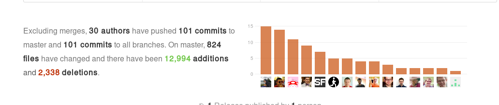
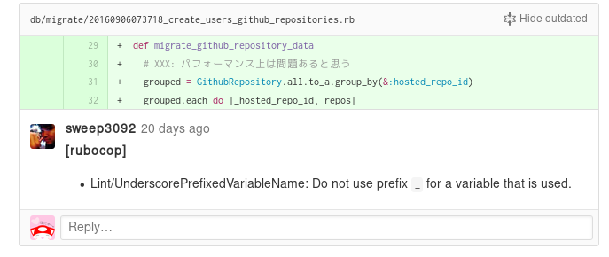

---

# Abount me

---


## Masataka Kuwabara (a.k.a. pocke)

- Engineer at Actcat Inc.
- Student at The Open University of Japan
- ♥ OSS
- ♥ Lint tool


---

# Works

- RuboCop
- SideCI

---


# RuboCop

---

## RuboCop

> A Ruby static code analyzer

An OSS lint tool for Ruby.

---


## For example

```ruby
# Bad code! Space is necessary!
1+1*2+3

# Good Code!
1 + 1 * 2 + 3
```


---

## Contribution by me

29 pull requests are merged!

https://github.com/bbatsov/rubocop/pulls?utf8=%E2%9C%93&q=is%3Apr%20author%3Apocke%20is%3Amerged

- Add new cop [#3588](https://github.com/bbatsov/rubocop/pull/3588) [#3492](https://github.com/bbatsov/rubocop/pull/3492) [#3415](https://github.com/bbatsov/rubocop/pull/3415)
- Improve development environment [#3533](https://github.com/bbatsov/rubocop/pull/3533) [#3594](https://github.com/bbatsov/rubocop/pull/3594)
- Bug fix
- Implement Auto-Correction
- And more!


---

## Articles

- [RuboCop 0.44.0 / 0.44.1 のCHANGELOGを読む - SideCI TechBlog](http://tech.sideci.com/entry/2016/10/20/110000)
- [RuboCop 0.43.0 の CHANGELOG を読む - SideCI TechBlog](http://tech.sideci.com/entry/2016/09/20/133051)
- [RuboCop 0.41 / 0.41.1 がリリースされました。 - SideCI TechBlog](http://tech.sideci.com/entry/2016/06/28/100415)
- [実践!! RuboCopプラグイン開発入門 - SideCI TechBlog](http://tech.sideci.com/entry/2016/06/09/111926)

---

Top 3 contributor



---


# SideCi

---

## SideCI

> Improve team productivity by automating code reviews with SideCI.

Lint tool as a Service

---

Comment to GitHub




---

## Contribution by me


- Support new lint tool
  - TypeScript, Python, Golang, etc...
- Fix bug of lint tool
- Add features for Rails application
- And more!


---


# Vision


---


- For developer
	- I ♥ OSS, Library, tool....
	- Make happy the world by the above.
	- Make happy the world by my technology.
- Freedom
